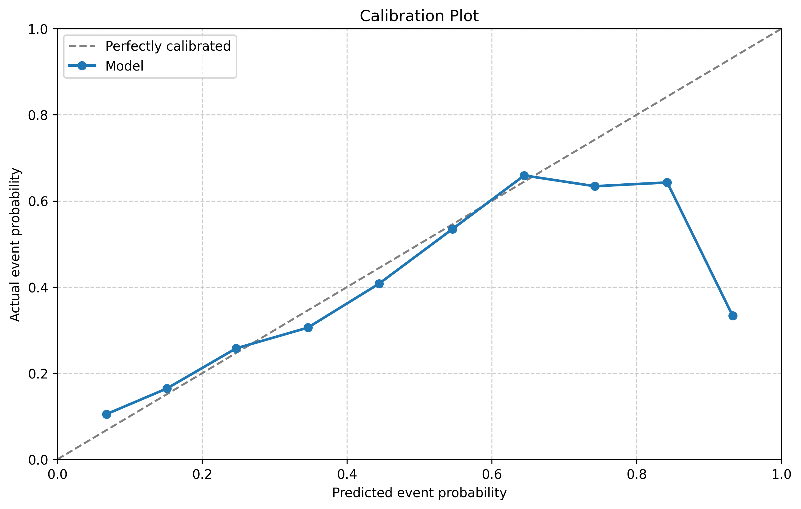
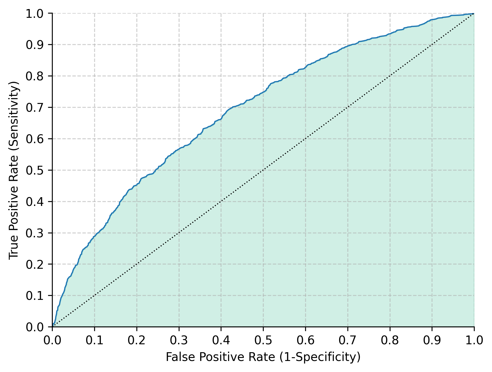
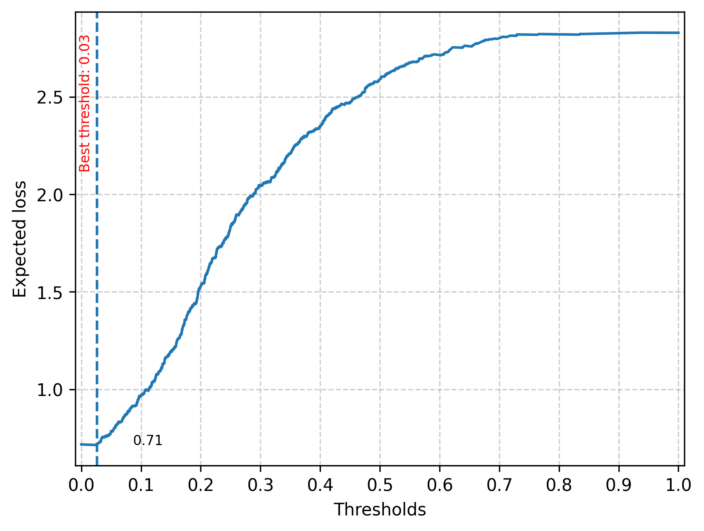
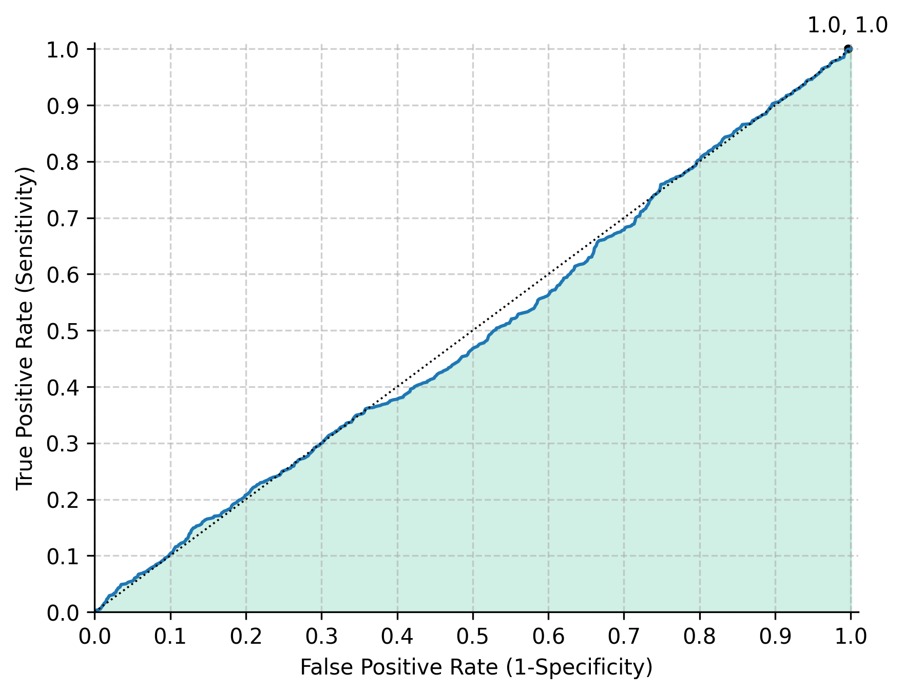
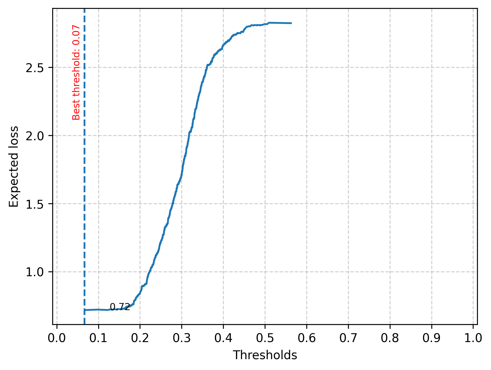
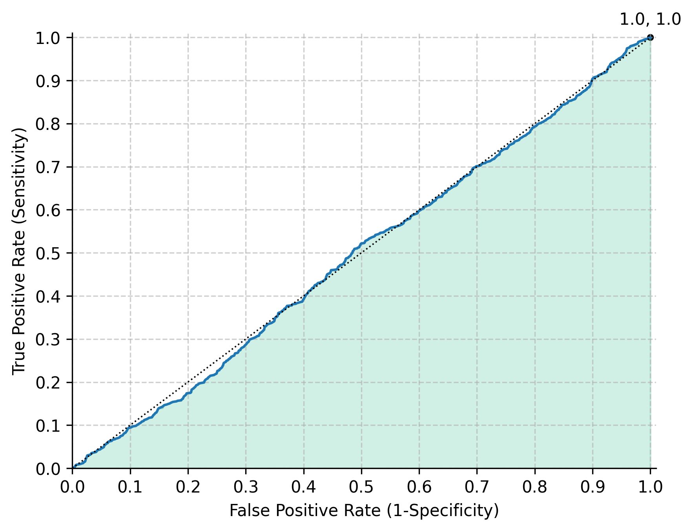

# Technical Report: Predicting Firm Fast Growth

Code: [firm-fast-growth-prediction.ipynb](https://github.com/guiqvlaixi2164-max/Data-Analysis-3/blob/main/Assignment%202/code/firm-fast-growth-prediction.ipynb)

## 1. Project Overview

**Objective:**
Build a binary classification model to predict whether a firm will experience fast growth, defined as ≥20% year-over-year growth in total assets from 2012 to 2013. The project proceeds in three stages: (I) probability prediction with cross-validated model comparison, (II) classification with a custom business loss function, and (III) discussion of practical applicability. An optional industry-level analysis compares performance across manufacturing and services sectors.

**Dataset:**
The bisnode-firms panel dataset (2010–2015), filtered to a 2012 cross-section of alive firms with revenues between €1,000 and €10 million. After cleaning, the modeling sample contains 19,996 observations with 118 features. The fast growth base rate is 28.86% (5,770 positive cases).

**Definition of Fast Growth:**
Total assets were chosen over employee counts or revenue because they capture the full scale of resource deployment (property, equipment, working capital, intangibles), are comparable across capital-intensive and knowledge-intensive industries, and are mandatory balance sheet items with standardized accounting treatment. The 20% threshold falls roughly at the 75th–80th percentile of SME growth rates, filtering out organic growth noise while capturing firms making substantive strategic investments. Growth is measured from 2012 to 2013 to avoid contamination from the 2008–2009 crisis.

---

## 2. Data Preparation

### 2.1 Panel Balancing and Initial Cleaning

The raw panel was balanced by filling missing year–firm combinations, and five columns with excessive missingness were dropped (`COGS`, `finished_prod`, `net_dom_sales`, `net_exp_sales`, `wages`). Year 2016 was excluded. A `status_alive` indicator was created for firms with positive sales.

### 2.2 Label Construction

Total assets were computed as the sum of three balance sheet components (intangible assets, current assets, and fixed assets), with negative values floored to zero and flagged. The asset growth rate was then calculated as the year-over-year percentage change in total assets from 2012 to 2013. Firms with growth rates ≥ 20% were labeled as fast-growth (1); all others as non-fast-growth (0). Observations with missing or invalid total assets in either year were excluded.

### 2.3 Sample Design

The analysis uses a cross-section of firms that were alive in 2012 with annual revenues between €1,000 and €10 million. This revenue filter focuses on small and medium enterprises (SMEs) while excluding micro-entities and larger firms whose growth dynamics differ substantially.

### 2.4 Feature Engineering

**Sales transformations:**
Log sales, sales in millions, and first-differenced log sales (a growth rate proxy) were created. Negative sales were replaced with 1. For new firms (age ≤ 1 or incomplete balance sheet year), the sales growth variable was set to 0.

**Financial ratios:**
Eight profit & loss items were normalized by sales (e.g., `extra_exp / sales`), and eight balance sheet items were normalized by total assets (e.g., `curr_assets / total_assets`). Infinite or missing values resulting from zero denominators were replaced with 0.

**Winsorization and flags:**
Ratios bounded at [0, 1] or [−1, 1] were winsorized, with corresponding flag indicators created for values that exceeded bounds or were erroneous. Quadratic terms were added for variables that can take any sign (e.g., income before tax) to allow U-shaped relationships. Zero-variance flag columns were dropped.

**Growth-relevant features.** Eight additional features were engineered:

| Feature | Formula | Notes |
|---|---|---|
| `asset_tangibility` | `tang_assets / total_assets` | Physical capital intensity |
| `liquidity_ratio` | `curr_assets / curr_liab` | Winsorized at 10 |
| `roa` | `profit_loss_year / total_assets` | Clipped to [−1, 1] |
| `labor_intensity` | `personnel_exp / sales` | From P&L ratio |
| `leverage` | `(total_assets − share_eq) / total_assets` | Clipped to [0, 1] |
| `ln_total_assets` | `log(total_assets)` | Firm size |
| `age_cat` | Binned age | young/medium/mature/old |
| `young_high_roa` | `(age ≤ 5) & (roa > 0.1)` | High-potential startup interaction |

**Industry consolidation.** The two-digit industry code was collapsed into broader categories: codes <26 → 20, 31 → 30, 36–54 → 40, >56 → 60, missing → 99.

---

## 3. Model Specification

### 3.1 Variable Sets

Models were built from modular variable blocks of increasing richness:

- **Raw financials** (16 vars): balance sheet and P&L items such as current assets, current liabilities, extra expenses/income, etc.
- **Engineered ratios** (12 vars): balance sheet and P&L items normalized by total assets or sales (e.g., `liq_assets_bs`, `curr_assets_bs`)
- **Quadratic terms** (3 vars): squared versions of signed ratios to capture non-linear effects
- **Flag indicators** (~20 vars): dummy variables marking winsorized or erroneous observations
- **Sales growth** (1 var): winsorized first-differenced log sales
- **HR and firm characteristics** (7 vars): CEO gender, foreign management, firm age (linear and squared), new firm indicator, industry category, and regional indicator
- **Growth features** (6 vars): asset tangibility, liquidity ratio, ROA, leverage, log total assets, and young × high-ROA interaction

### 3.2 Five Logit Specifications

| Model | Description | # Coefficients |
|---|---|---|
| M1 | Log sales + sales growth + profitability ratio | 4 |
| M2 | M1 + balance sheet ratios + age + foreign management | 9 |
| M3 | Log sales + all engineered ratios + sales growth + HR/firm characteristics + growth features | 30 |
| M4 | M3 + quadratic terms + flag indicators + quality variables | 61 |
| M5 | M4 + industry × age/sales/gender interactions + size interactions | 162 |

Each successive model adds more complexity. The goal is to determine whether additional variables improve predictive performance or lead to overfitting.

### 3.3 LASSO Logit

Uses the M5-level variable set (the most complex specification) with an additional squared log-sales term. Features were standardized prior to fitting. Regularization strength was searched over 10 values of λ spaced evenly on the log scale between 10⁻¹ and 10⁻⁴. The best λ was selected by minimum mean CV RMSE (converted from negative Brier score). The optimal LASSO retained **74 non-zero coefficients** out of the original 162+, automatically discarding redundant or uninformative features.

### 3.4 Random Forest

The Random Forest used 100 trees with Gini splitting. Hyperparameters were tuned via 5-fold cross-validated grid search over `max_features` ∈ {5, 6, 7} and `min_samples_split` ∈ {11, 16}. Best parameters: `max_features=6`, `min_samples_split=16`.

---

## 4. Part I: Probability Prediction Results

### 4.1 Cross-Validation Setup

An 80/20 train-holdout split was applied (`random_state=42`), yielding 15,997 training and 3,999 holdout observations. All CV used 5-fold cross-validation with shuffling.

### 4.2 Summary of CV Performance

| Model | # Coefficients | CV RMSE | CV AUC | Training Time |
|---|---|---|---|---|
| M1 | 4 | 0.452 | 0.564 | — |
| M2 | 9 | 0.436 | 0.672 | — |
| M3 | 30 | 0.425 | 0.716 | — |
| **M4** | **61** | **0.425** | **0.718** | — |
| M5 | 162 | 0.426 | 0.715 | — |
| LASSO | 74 | 0.425 | 0.718 | 80.5s |
| RF | n.a. | 0.426 | 0.714 | 153.0s |

All logit models were trained in ~333s total.

RMSE measures how close the predicted probabilities are to the actual outcomes (lower is better). AUC measures how well the model ranks fast-growth firms above non-growth firms (higher is better; 0.5 = random, 1.0 = perfect). An AUC of ~0.72 means that if we pick one random fast-growth firm and one random non-growth firm, the model assigns a higher probability to the fast-growth firm about 72% of the time.

### 4.3 Model Selection Rationale

M4, M5, and LASSO achieve nearly identical CV RMSE (~0.425). **M4** was selected as the preferred model because it achieves the highest AUC (0.718), indicating the best discrimination ability — i.e., it is the best at ranking fast-growth firms above non-growth firms. M4 is also simpler than M5 (61 vs. 162 coefficients) and does not require the feature standardization that LASSO needs. Adding M5's interaction terms did not improve AUC (0.715), suggesting those interactions are not informative. RF shows comparable RMSE but slightly lower AUC (0.714).

### 4.4 Holdout Evaluation

M4 holdout RMSE: **0.429**. RF holdout RMSE: **0.429**, AUC: **0.696**.

The slight increase from CV RMSE (0.425) to holdout RMSE (0.429) indicates minimal overfitting — the model generalizes well to unseen data.

The calibration plot compares predicted probabilities against actual fast-growth rates. Points close to the diagonal line indicate well-calibrated predictions. Deviations reveal where the model over- or under-estimates the probability of fast growth.

The ROC curve shows the trade-off between catching fast-growth firms (sensitivity, y-axis) and incorrectly flagging non-growth firms (false positive rate, x-axis) at every possible threshold. The shaded area under the curve represents the AUC. A curve hugging the top-left corner would indicate near-perfect discrimination; our curve shows moderate but meaningful discriminative ability.

---

## 5. Part II: Classification

### 5.1 Business Problem

The model serves as a venture capital screening tool that flags firms likely to experience fast growth from a large candidate pool. Analysts then prioritize flagged firms for due diligence.

### 5.2 Loss Function

Asymmetric costs reflect VC economics:

- **FP = $1** — wasted analyst time reviewing a non-growth firm
- **FN = $10** — opportunity cost of missing a fast-growing firm

The 10:1 ratio captures the VC principle that missing a winner is far more costly than evaluating a non-winner. This asymmetry will push the optimal classification threshold well below the conventional 0.5, because it is 10 times more important to avoid missing a fast-grower than to avoid a false alarm.

### 5.3 Optimal Threshold Search

For each model and CV fold, the classification threshold was chosen to minimize the total expected loss. The search iterates over all possible thresholds along the ROC curve, computing at each point:

> Expected loss = (FP count × $1 + FN count × $10) / N

The threshold that produces the lowest expected loss is selected as the optimal threshold for that fold. Results are averaged across the 5 folds.

### 5.4 Classification Results

| Model | Avg Optimal Threshold | Avg Expected Loss |
|---|---|---|
| **M1** | 0.1489 | **0.7092** |
| M2 | 0.0460 | 0.7111 |
| M3 | 0.0193 | 0.7116 |
| M4 | 0.0120 | 0.7112 |
| M5 | 0.0032 | 0.7113 |
| LASSO | 0.0215 | 0.7117 |
| RF | 0.1097 | 0.7134 |

M1 achieves the lowest average expected loss ($0.7092), which is notable: the simplest model wins on business-relevant loss despite having the worst CV RMSE and AUC. This happens because the extreme cost asymmetry pushes thresholds so low that all models end up flagging nearly every firm, and differences in probability calibration matter less than the overall threshold behavior. However, **M4 was selected for holdout evaluation** because its higher AUC (0.718 vs. 0.564) reflects genuinely better discrimination ability — it ranks firms more accurately, which matters if the loss function or cost assumptions change in deployment.

The following plots illustrate the loss function and ROC curve for M4 and Random Forest on Fold 5 of cross-validation.

The loss curve shows expected loss (y-axis) at each possible threshold (x-axis). The dashed vertical line marks the optimal threshold that minimizes expected loss. The curve is steep near zero and flattens at higher thresholds, reflecting that the cost of missing fast-growers (FN) dominates when the threshold is set too high.

The ROC curve with the optimal threshold marked as a black dot. The dot's position near the top-right of the curve shows that at the optimal threshold, the model achieves very high sensitivity (catching most fast-growers) at the cost of a high false positive rate (flagging most non-growers as well).

The Random Forest loss curve shows a similar shape but with a higher optimal threshold than M4. RF's discrete tree structure produces a less smooth loss curve, and its optimal threshold tends to be higher because the ensemble's probability predictions are less extreme at the tails.

The RF ROC curve with its optimal threshold marked. Compared to M4, the optimal point sits slightly further from the top-right corner, indicating that RF misses more fast-growth firms at its optimal threshold.

### 5.5 Holdout Expected Loss

M4 holdout expected loss: **$0.716**. RF holdout expected loss: **$0.727**.

M4 outperforms RF by $0.011 per firm (1.5% lower loss). For a screening pool of 1,000 firms, this translates to approximately $11 in savings. Both models achieve similar expected losses, but M4's advantage comes from logistic regression's sigmoid function, which allows stable probability estimates at very low thresholds — an advantage over RF's discrete tree structure that struggles to calibrate below ~10–15% predicted probability.

---

## 6. Part III: Discussion of Results

### 6.1 Confusion Matrix (M4, Holdout)

|  | Predicted No Growth | Predicted Fast Growth |
|---|---|---|
| **Actual No Growth** | 4 | 2,852 |
| **Actual Fast Growth** | 1 | 1,143 |

With threshold 0.0091, M4 achieves 99.91% sensitivity (catches 1,143 of 1,144 fast-growth firms) but only 0.14% specificity and 28.61% precision. The model essentially flags nearly every firm as a potential fast-grower — a direct consequence of the extreme FN/FP cost asymmetry pushing the threshold near zero.

The expected loss breaks down as:
- False Positive cost: 2,852 × 1 = 2,852
- False Negative cost: 1 × 10 = 10
- Total: 2,862 for 4,000 firms (0.716 per firm)

### 6.2 Comparison with Universal Flagging

A key finding is that the model's expected loss (0.716 per firm) is virtually identical to — and very slightly worse than — simply flagging all firms as fast-growth (0.714 per firm). This is because with a 28.86% base rate and 10:1 cost asymmetry, the mathematically optimal strategy converges toward universal flagging. The model's optimal threshold (0.0091) is so close to zero that it flags 3,995 out of 4,000 firms, leaving almost no room to improve over the naive baseline.

This does not mean the model is useless. The predicted probabilities still provide a meaningful ranking — firms with higher predicted probabilities are more likely to be true fast-growers. In practice, analysts could use the probability ranking to prioritize which flagged firms to review first, even if the binary classification itself adds little value over flagging everyone.

### 6.3 Practical Assessment

The predictions are actionable as a first-pass screening tool: analysts can prioritize flagged firms for deeper due diligence by ranking them by predicted probability, rather than treating the binary flag as a final investment decision.

Key limitations include:

- **Single-year definition:** Fast growth is measured over 2012–2013 only. A firm that grew rapidly in that specific year may not sustain growth, and the model may not generalize to other time periods.
- **Macroeconomic sensitivity:** The model cannot capture economy-wide shocks or industry disruptions that affect growth patterns.
- **Near-universal flagging:** With the current loss function, the model flags ~99.9% of firms. Its practical value lies in the probability ranking, not the binary classification.
- **No external validation:** The model has not been tested on out-of-sample time periods, which would strengthen confidence before deployment.

---

## 7. Industry Analysis

### 7.1 Setup

Two subsamples were defined: Manufacturing (`ind2_cat` ∈ {20, 30}) and Services (`ind2_cat` ∈ {40, 60}). Both use the same loss function (FP=$1, FN=$10). Industry-specific logit (M4-style, without the industry category variable) and RF models were trained with 5-fold CV.

### 7.2 Results

| Metric | Manufacturing | Services |
|---|---|---|
| Train size | 175 | 340 |
| Fast growth rate (train) | 26.86% | 27.65% |
| Holdout size | 38 | 88 |
| Logit CV RMSE | 0.5434 | 0.4782 |
| Logit Avg Expected Loss | **0.6175** | 0.6691 |
| RF CV RMSE | 0.4427 | **0.4227** |
| RF Avg Expected Loss | 0.6569 | **0.6623** |
| **Recommended** | **Logit** | **RF** |

### 7.3 Key Takeaways

**Sample size concerns.** Both subsamples are very small (175 and 340 training observations). Manufacturing is particularly problematic: its holdout fast-growth rate is 42.11%, far higher than the 26.86% training rate. This large discrepancy suggests that with only 38 holdout firms, the split is not representative, and results should be treated as exploratory rather than reliable.

**Statistical accuracy vs. business outcome.** An interesting pattern emerges: RF achieves better probability predictions (lower RMSE) in both sectors, yet Logit achieves lower expected loss in both. This happens because Logit's sigmoid function allows it to set extremely low thresholds (0.0022 for manufacturing, 0.0093 for services), flagging nearly all firms and minimizing costly false negatives. RF's thresholds are much higher (0.1475 and 0.1272), which means it misses more fast-growers — a costly mistake under the 10:1 asymmetry.

**Recommendation.** The full-sample pooled model with 15,997 training observations provides more stable and trustworthy predictions than either industry-specific model. Industry effects are better incorporated as features within the unified model rather than by splitting the data into subsamples too small for reliable modeling.

---

